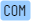
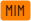

> Academic spam is the practice of sending unwanted email messages, promoting academic conferences, publishing opportunities, invitations to joining editorial boards and program committees.

This projects lists academic events, publications and websites that spam me. Some of the entries might be legitimate academic businesses, however they are included because of utilizing unwanted practices. This list does not contain non-academic spam sources promoting enlargement pills, cat food, financing opportunities and deseased rich people with no relatives.

# Table of contents

- [Spam events](#spam-events)
- [Spam journals](#spam-journals)
- [Spam mailing services](#spam-mailing-services)
- [Tags](#tags)

<!--
## Spam sites

This list contains sites that have sent me academic spam. They are blocked in my email filters. The web sites are extracted from the email headers (the earliest domain in the `Received` element that appears not to be faked).
-->

# Spam events

This is a list of events that have been promoted via spam emails. This does not mean the events are not legit, but it raises concerns. Click on links at your own discretion.

| Event | Full name | Tags |
|---|---|---|
| | Blacksea Coastline Countries Scientific Research Conference   *www.blackseacountries.org/conference* |     |
| | Eurasia Conferences   *[eurasiaconferences.com](eurasiaconferences.com)* |    |
| | European Congress on Interdisciplinary Scientific Research   *www.eucongress.org* |    |
| WorldCIST | World Conference on Information Systems and Technologies   *[worldcist.org](worldcist.org)* |     |

# Spam journals

This is a list of journals that have been promoted via spam emails. This does not mean the journal are not legit, but it raises concerns. Click on links at your own discretion.

| Journal | Full name | Tags |
|---|---|---|
| EJ-EDU | European Journal of Education and Pedagogy   www.ej-edu.org |    |
| IJES | International Journal of Engineering and Science   www.theijes.com |      |
| JBEM | Journal of Business & Economic Management |       |

# Spam mailing services

This is a list of services used to sent academic spam messages. They are all blocked in my email client.

| Site | Tags |
|---|---|
| acaademiaa.com |    |
| eurasiatalk.com |   |
| euromsg.net |   |
| mailjet.com |   |
| mjt.lu |   |
| point4web.com |   |
| replitest.com |   |
| sendinbx.com |    |
| techinhosting.com |   |

<!--
## Spam IP addresses

This list contains sites that have sent me academic spam. They are blocked in my email filters. The web sites try to hide their domains, but the IP address or origin is found in the email header.
-->

# Tags

| Tag | Description |
|---|---|
|  | Using a fake sender email, domain or IP address |
|  | Mimiking legitimate sites, using different submission methods, typos in domain names |
|  | Using common email (e.g. gmail.com, yahoo.com, etc) instead of dedicated email |
|  | Using services for mass emailing |
|  | Hiding links or using tracking |
|  | Unrelated, unvisited, unknown conferences |
|  | Known to follow predatory activities or included in Beall's list |
|  | Using misleading or custom ranking, e.g. IF which is not from Web of Science |
|  | Anything that make me feel abused, forced, or cheated |

