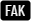
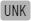

> Academic spam is the practice of sending unwanted email messages, promoting academic conferences, publishing opportunities, invitations to joining editorial boards and program committes.

This projects lists academic events, publications and websites that spam me. Some of the entries might be legitimate academic businesses, however they are included because of utilizing unwanted practices. This list does not contain non-academic spam sources like enlargement pills, cat food, financing opportunities and deseased rich people with no relatives.

<!--
## Spam sites

This list contains sites that have sent me academic spam. They are blocked in my email filters. The web sites are extracted from the email headers (the earliest domain in the `Received` element that appears not to be faked).
-->

## Spam events

This is a list of events that have been promoted via spam emails. This does not mean the events are not legit, but it raises concerns. Click on links at your own discretion.

| Event | Tags |
|---|---|
| Blacksea Coastline Countries Scientific Research Conference   *www.blackseacountries.org/conference* |     |
| European Congress on Interdisciplinary Scientific Research   *www.eucongress.org* |    |

## Spam journals

This is a list of journals that have been promoted via spam emails. This does not mean the journal are not legit, but it raises concerns. Click on links at your own discretion.

| Journal | Full name | URL | Tags |
|---|---|---|---|
| EJ-EDU | European Journal of Education and Pedagogy | www.ej-edu.org |    |
| IJES | International Journal of Engineering and Science | www.theijes.com |      |

## Spam mailing services

This is a list of services used to sent academic spam messages. They are all blocked in my email client.

| Site | Tags |
|---|---|
| mailjet.com |   |
| mjt.lu |   |
| point4web.com |   |
| replitest.com |   |
| sendinbx.com |    |
| euromsg.net |   |

<!--
## Spam IP addresses

This list contains sites that have sent me academic spam. They are blocked in my email filters. The web sites try to hide their domains, but the IP address or origin is found in the email header.
-->

## Tags

| Tag | Description |
|---|---|
|  | Using a fake sender email, domain or IP address |
|  | Using services for mass emailing |
|  | Hiding links or using tracking |
|  | Unrelated, unvisited, unknown conferences |
|  | Known to follow predatory activities or included in Beall's list |
|  | Using misleading or custom ranking, e.g. IF which is not from Web of Science |
|  | Mimiking actual academic institutions, events and publications |
|  | Anything that make me feel abused, forced, or cheated |

